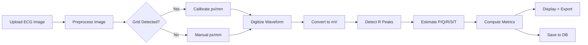
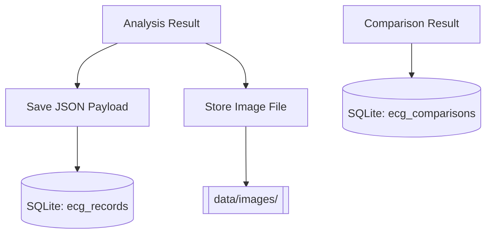

# Design Document — ECG Graph Extraction and Analysis System

## 1. Overview
This application ingests ECG graph images (PNG/JPG/PDF), digitizes the waveform, extracts clinically relevant features, enables comparison between ECGs, and stores results in a local SQLite database. The GUI is implemented with Streamlit.

## 2. Goals
- Provide a simple GUI for clinicians/researchers.
- Support preprocessing, digitization, feature extraction, and comparison.
- Persist results and original images for traceability.
- Export analysis and comparison outputs to CSV/JSON.

## 3. Non‑Goals
- Clinical diagnosis or regulatory‑grade validation.
- Full multi‑lead ECG segmentation in the MVP.
- Real‑time signal acquisition.

## 4. Architecture
**Pipeline‑based modular architecture** with clear boundaries:

1. **UI Layer (Streamlit)**
   - Upload ECG images or pick stored records (independently per comparison sample).
   - Display plots, metrics, and export options.

2. **Processing Layer**
   - Preprocessing: denoise + contrast enhancement.
   - Grid detection: estimate pixels per mm.
   - Digitization: trace waveform from grid image.
   - Feature extraction: estimate P/Q/R/S/T indices.
   - Metric computation: HR, RR, PR, QRS, QT.

3. **Comparison Layer**
   - Alignment by R‑peak or cross‑correlation fallback.
   - Delta waveform and metric comparison.

4. **Persistence Layer (SQLite + file storage)**
   - Original images stored on disk.
   - Analyses stored as JSON blobs in SQLite.

## 5. Data Flow
1. User uploads ECG image.
2. Preprocessing enhances and denoises the image.
3. Grid spacing (px/mm) is detected or manually set.
4. Waveform is digitized and converted to mV.
5. Features and metrics are extracted.
6. Results are displayed and optionally saved.
7. Two ECGs (each from an upload or a stored record) can be aligned and compared.
8. CSV/JSON exports are generated.

## 5.1 Workflow Diagrams

### 5.1.1 Analysis Workflow


### 5.1.2 Comparison Workflow
```mermaid
flowchart LR
   A[Select ECG A (record or upload)] --> C[Load/Analyze ECG A]
   B[Select ECG B (record or upload)] --> D[Load/Analyze ECG B]
   C --> E[Align Signals]
   D --> E
   E --> F[Compute Delta Waveform]
   E --> G[Compute Delta Metrics]
   F --> H[Visualize Overlay + Delta]
   G --> I[Export Comparison]
```

### 5.1.3 Data Persistence Workflow


## 6. Key Algorithms
- **Grid detection:** morphological detection of gridlines and peak spacing.
- **Waveform tracing:** column‑wise dark pixel detection + smoothing.
- **R‑peak detection:** `scipy.signal.find_peaks` with distance/prominence constraints.
- **Feature estimation:** windowed search around R‑peaks.
- **Alignment:** R‑peak alignment; cross‑correlation fallback.

## 7. Database Schema
**Table: ecg_records**
- `id` (PK)
- `patient_id`
- `ecg_datetime`
- `root_cause`
- `root_cause_time`
- `image_filename`
- `image_hash`
- `analysis_json`
- `created_at`

**Table: ecg_comparisons**
- `id` (PK)
- `record_a_id`
- `record_b_id`
- `alignment_method`
- `delta_json`
- `created_at`

## 8. UI Design
**Tabs:** Analyze, Compare, Records
- Analyze: upload, set calibration, run analysis, plot, export, save.
- Compare: choose two ECGs with independent sources (record or upload), align, visualize delta, export comparison.
- Records: view stored analyses.

## 9. Error Handling
- Invalid files rejected with UI errors.
- Grid detection failures trigger manual calibration.
- Missing R‑peaks fallback to correlation alignment.

## 10. Extensibility
- Replace digitization with more robust tracing (e.g., deep learning‑based).
- Add multi‑lead parsing and lead selection.
- Add advanced clinical metrics (QTc, ST deviation, etc.).
- Add user authentication and multi‑user storage.

## 11. Security & Privacy
- Local‑only storage by default.
- No network data transmission.
- Images remain unmodified; hashes ensure integrity.

## 12. Testing Strategy
- Unit tests for preprocessing, digitization, and metrics.
- Golden‑file tests with known ECG samples.
- UI smoke tests with typical uploads.

## 13. Known Limitations
- Accuracy depends on image quality and grid visibility.
- Current P/Q/S/T detection is heuristic‑based.
- Multi‑lead parsing not included in MVP.
