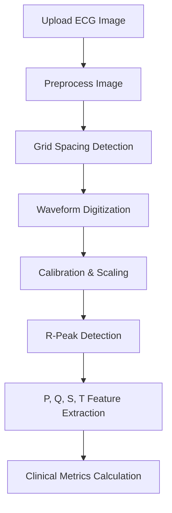

# ECG Waveform Analysis and Parameter Extraction

This document explains the core ECG analysis pipeline, feature extraction heuristics, and calculated clinical parameters implemented in the system. The analysis logic is situated in [analyzer.py](file:///c:/Projects/ECGComparisonPython/analyzer.py).

---

## 1. The Analysis Pipeline Workflow

The pipeline parses a raw ECG paper recording image and translates it into digitized signal data and diagnostic metrics through the following stages:

### Stage 1: Preprocessing
* **Method**: `preprocess_image`
* **Implementation Details**:
  - Converts the input image to grayscale.
  - Applies a median filter (`cv2.medianBlur` with a kernel size of 3) to smooth out scanning dust or camera grain.
  - Uses Contrast Limited Adaptive Histogram Equalization (**CLAHE**) with `clipLimit=2.0` and a grid of `8x8` to standardize brightness and contrast, making grid lines and waveforms visually distinct.

### Stage 2: Grid Spacing Detection
* **Method**: `detect_grid_spacing`
* **Implementation Details**:
  - Generates a thresholded binary mask.
  - Extracts horizontal and vertical lines using morphology opening (kernels relative to the image size, e.g., $\text{width}/40$).
  - Evaluates row and column intensity projection peaks (`scipy.signal.find_peaks`) and computes the median difference between them.
  - Returns the estimated pixels per 1 mm grid spacing. If this fails, the system defaults to a user-provided or fallback value.

### Stage 3: Waveform Digitization
* **Method**: `digitize_waveform`
* **Implementation Details**:
  - Iterates column by column, isolating the lowest-intensity (darkest/most-contrasting) pixel index to trace the lead trace path.
  - Linear interpolation (`pd.Series.interpolate`) handles columns where the trace line is broken or faint.
  - Passes the raw indices through a **Savitzky-Golay filter** (`polyorder=2`, window based on resolution) to smooth out digitization noise while preserving peak heights.

### Stage 4: Calibration & Centering
* **Method**: `waveform_to_signal`
* **Implementation Details**:
  - Identifies the signal baseline by taking the median $y$-value of the trace.
  - Centers the signal around $0\text{ mV}$ (subtracting the baseline).
  - Converts vertical pixel displacement to voltage amplitude in millivolts ($\text{mV}$) and horizontal spacing to milliseconds ($\text{ms}$):
    $$\text{ms per sample} = \frac{40}{\text{pixels per mm}}$$
    $$\text{mV per sample} = \frac{0.1}{\text{pixels per mm}}$$

### Stage 5: Feature Landmark Extraction
* **Method**: `detect_r_peaks` & `extract_features`
* **Implementation Details**:
  - **R-peaks**: Located first using `scipy.signal.find_peaks` with distance constraints corresponding to an absolute refractory period of $\approx 200\text{ ms}$ and a minimum prominence relative to the signal standard deviation.
  - **Other Wave Landmarks**: Inferred by running local extrema searches within temporal windows around each R-peak:
    - **Q-peak**: Local minimum in a $60\text{ ms}$ window preceding the R-peak.
    - **S-peak**: Local minimum in a $60\text{ ms}$ window succeeding the R-peak.
    - **P-peak**: Local maximum in a $200\text{ ms}$ window preceding the Q-peak.
    - **T-peak**: Local maximum in a $240\text{ ms}$ window succeeding the S-peak.

---

## 2. Parameter Reference Guide

The analysis output dictionary contains two primary segments: raw waveforms and derived clinical metrics.

### Waveform Datasets

* **`signal_mV`**: 1D list representing the baseline-centered ECG trace voltage amplitude values in millivolts ($\text{mV}$).
* **`time_ms`**: 1D list representing the corresponding time elapsed in milliseconds ($\text{ms}$).
* **`features`**: Contains the sample index offsets of the parsed features:
  - `p_peaks`, `q_peaks`, `r_peaks`, `s_peaks`, `t_peaks`

### Clinical Metrics (`metrics` block)

| Parameter Key | UI Label | Calculation & Purpose |
| :--- | :--- | :--- |
| **`heart_rate_bpm`** | Heart Rate (bpm) | Measures the ventricular rate in beats per minute. Calculated using the mean of the R-to-R intervals: $$\text{HR} = \frac{60000}{\text{mean}(\text{RR intervals in ms})}$$ |
| **`rr_intervals_ms`** | RR Intervals (ms) | A sequence containing the time gaps in milliseconds between all successive R-peaks. Used to evaluate heart rate variability. |
| **`pr_interval_ms`** | PR Interval (ms) | Represents the duration of atrioventricular conduction. Estimated as the average time interval from P-peak to R-peak. |
| **`qrs_duration_ms`** | QRS Duration (ms) | Represents ventricular depolarization time. Estimated as the average time interval from Q-peak to S-peak. |
| **`qt_interval_ms`** | QT Interval (ms) | Represents the duration of ventricular depolarization and repolarization. Estimated as the average time interval from Q-peak to T-peak. |

---

## 2.1 Database Persistence Mapping

While the runtime application uses nested dictionaries to represent analysis payloads (for backwards compatibility), these fields are stored directly in individual database columns in SQLite (Schema Version 3) under the `ecg_records` table:

* **Calibration Constants**: `ms_per_pixel` (REAL), `mV_per_pixel` (REAL), `pixels_per_mm` (REAL).
* **Waveform Coordinate Arrays**: `signal_mV` (TEXT), `time_ms` (TEXT) stored as serialized JSON lists.
* **Feature Indexes**: `p_peaks`, `q_peaks`, `r_peaks`, `s_peaks`, `t_peaks` (TEXT) stored as serialized JSON lists.
* **Clinical Metrics**: `heart_rate_bpm` (REAL), `pr_interval_ms` (REAL), `qrs_duration_ms` (REAL), `qt_interval_ms` (REAL), and `rr_intervals_ms` (TEXT).

Similarly, the comparisons table (`ecg_comparisons`) separates delta metric attributes into individual columns: `heart_rate_bpm`, `pr_interval_ms`, `qrs_duration_ms`, and `qt_interval_ms`.

---

## 3. Signal Comparison & Delta Metrics

To track changes over time, monitor therapy response, or compare separate patient records side-by-side, the system incorporates a dedicated **ECG Comparison Module**. This module is implemented primarily via the `ECGAligner` class in [analyzer.py](file:///c:/Projects/ECGComparisonPython/analyzer.py#L268), integrated into the Streamlit Web UI ([ECGComparisonPython.py](file:///c:/Projects/ECGComparisonPython/ECGComparisonPython.py)), and exposed via the FastAPI backend ([main.py](file:///c:/Projects/ECGComparisonPython/mobile_backend/main.py)).

### A. Temporal Waveform Alignment (`align_signals`)

Direct mathematical comparison between two digitized ECG streams requires precise alignment in the time domain to account for differing start offsets. The `align_signals` algorithm implements a robust **dual-strategy alignment pipeline**:

1. **First-Refractory R-Peak Offset Alignment (Primary Method)**:
   - When R-peaks are successfully extracted in both recordings ($R_A \neq \emptyset$ and $R_B \neq \emptyset$), alignment is keyed to the **first detected ventricular depolarization**.
   - The sample shift is computed as:
     $$\text{shift} = R_B[0] - R_A[0]$$
   - This shifts Signal B relative to Signal A so that their initial QRS complexes overlay exactly, aligning downstream interval analyses (like QT and PR segments).

2. **DC-Subtracted Cross-Correlation Alignment (Fallback Method)**:
   - In noisy captures or instances with severe dysrhythmias where R-peak detection fails, the aligner falls back to computing cross-correlation in the spatial-frequency domain.
   - To eliminate baseline wander biases, both signals are first centered on zero mean:
     $$\tilde{S}_A = S_A - \mu_A, \quad \tilde{S}_B = S_B - \mu_B$$
   - The cross-correlation sequence is computed as:
     $$\text{Corr}[m] = \sum_{n} \tilde{S}_B[n] \cdot \tilde{S}_A[n - m]$$
   - The optimal lag offset is the position of maximum cross-correlation peak:
     $$\text{shift} = \operatorname{argmax}_m (\text{Corr}[m]) - (N_A - 1)$$

3. **Cropping & Truncation**:
   - Depending on the computed shift:
     - If $\text{shift} > 0$: Signal B is cropped from the left: $S_B = S_B[\text{shift}:]$
     - If $\text{shift} < 0$: Signal A is cropped from the left: $S_A = S_A[-\text{shift}:]$
   - To perform sample-by-sample arithmetic comparisons, the tail ends of both signals are truncated to match the minimum remaining array length:
     $$\text{Length} = \min(|S_A|, |S_B|)$$

---

### B. Delta Clinical Metrics & Clinical Significance

The module calculates derived metrics representing the absolute changes between the target recording (ECG B) and the baseline recording (ECG A):

$$\Delta = \text{Metric}_{\text{ECG B}} - \text{Metric}_{\text{ECG A}}$$

The clinical parameters and their diagnostic implications include:

| Metric Delta Key | Clinical Parameter | Diagnostic / Investigative Significance |
| :--- | :--- | :--- |
| `heart_rate_bpm` | $\Delta$ Heart Rate | Evaluates chronotropic response. A positive delta indicates tachycardia trends; a negative delta indicates bradycardia trends. Useful in evaluating autonomic tone or responses to beta-blockade. |
| `pr_interval_ms` | $\Delta$ PR Interval | Tracks atrioventricular (AV) conduction delay changes. Widening ($\Delta > 0$) suggests progression toward first-degree AV block, common in cardiotoxic exposures (e.g. certain snake bites) or antiarrhythmic drug therapies. |
| `qrs_duration_ms` | $\Delta$ QRS Duration | Evaluates ventricular depolarization speed. Widening of the QRS complex ($\Delta > 0$) is associated with bundle branch blocks, hyperkalemia, or class IA/IC antiarrhythmic toxicities. |
| `qt_interval_ms` | $\Delta$ QT Interval | Evaluates ventricular repolarization changes. A positive delta indicates **QT prolongation**, which carries a risk of progression to *Torsades de Pointes*. Crucial for safety screening of cardiotoxic agents or QT-prolonging pharmaceuticals. |

---

### C. Backend API Integration & Programmatic Endpoints

For programmatic and mobile client access, the FastAPI server exposes specialized endpoints that delegate to the comparison pipeline:

1. **REST Comparison Endpoint (`/compare`)**:
   - **Method**: `POST`
   - **Payload**: Accepts either database-persisted record IDs (`record_a`, `record_b`) or inline raw analysis JSON payloads (`analysis_a`, `analysis_b`).
   - **Process**: Performs signal parsing, executes `align_signals`, and calculates numeric delta metrics.
   - **Response**: Returns a JSON structure containing:
     - `alignment_method` (either `"r-peak"` or `"cross-correlation"`)
     - `delta_metrics` dictionary
     - `aligned_a` and `aligned_b` (the shifted and cropped 1D float signal arrays)
     - `aligned_lengths`

2. **Plotting Endpoint (`/compare/plot`)**:
   - **Method**: `POST`
   - **Payload**: Aligned signal array lists (`aligned_a`, `aligned_b`).
   - **Process**: Builds a comparison plot on a headless matplotlib engine and saves it to a byte buffer.
   - **Response**: Encodes the figure as a **Base64-encoded PNG string** to eliminate the need for filesystem caching or local image hosting, allowing direct image consumption by the React Native client.

---

### D. Visual Diagnostics & Interpretation

The module renders two comparison figures for clinicians:

1. **Signal Overlay View (`render_comparison_plot`)**:
   - Visualizes both baseline (Blue) and target (Red, with `alpha=0.7`) signals on a single grid.
   - Allows direct visual identification of morphological changes, voltage differences (e.g. low voltage in pericardial effusion), or phase offsets.

2. **Differential Delta Waveform (`render_delta_plot`)**:
   - Renders a sample-by-sample difference trace:
     $$\text{Diff}[n] = S_B[n] - S_A[n]$$
   - Plotted in black with a dashed grey reference line at $0\text{ mV}$.
   - Deviations from zero highlight localized differences, making abnormalities like localized ST-segment elevations or T-wave inversions visually distinct.

