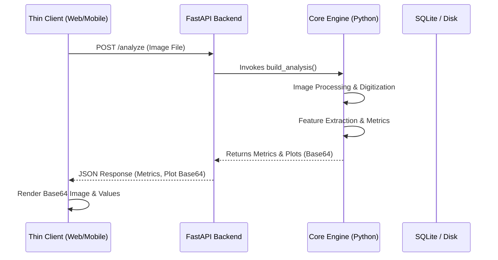

# Architecture Document: ECG Graph Extraction and Analysis System

This document outlines the high-level architecture of the ECG Graph Extraction and Analysis System. The system is designed to process ECG graph images, digitize waveforms, extract clinical features, and facilitate comparison, all while being accessible through both a thin web interface and a mobile application connected to a heavy FastAPI backend.

## 1. High-Level System Architecture

The project employs a client-server architecture. Core computations, database persistence, and visual rendering are handled by the **Heavy Server** (FastAPI backend), while the client applications act as **Thin Clients** communicating via HTTP.

```mermaid
flowchart TD
    subgraph Frontend Clients
        W[Streamlit Web UI (Thin Client)]
        M[React Native Mobile App (Thin Client)]
    end

    subgraph Backend Services
        F[FastAPI Server (Heavy Server)]
        C[Core Python Logic / ECG Engine]
    end

    subgraph Persistence Layer
        DB[(SQLite Database)]
        FS[Local File Storage]
    end

    W <--> F
    M <--> F
    F <--> C
    C <--> DB
    C <--> FS
```

### 1.1 Thin Streamlit Web UI (`ECGComparisonPython.py`)
The web application is a thin client presenting UI screens and components, completely decoupled from local databases or complex signal processing engines.
* **Responsibilities:**
  * **User Experience:** Renders tab interfaces for analysis, comparisons, records browsing, settings, and user management.
  * **API Requests Wrapper:** Communicates with the FastAPI server via HTTP `requests` for all calculations, grid spacing checks, and record saves.
  * **Plot Rendering:** Displays waveforms and comparison overlays by fetching base64-encoded PNG strings compiled by the backend server.

### 1.2 Core ECG Engine (`analyzer.py` / `db.py` / `auth.py`)
This is the foundational computing layer of the system, running on the server.
* **Responsibilities:**
  * **Preprocessing:** Denoising and contrast enhancement of ECG images.
  * **Analysis & Feature Extraction:** Grid spacing detection, waveform digitization, peak landmark calculations (P, Q, R, S, T), and interval metrics.
  * **Comparison Engine:** Temporal alignment of signal traces and delta estimations.

### 1.3 Backend API Server (`mobile_backend/main.py`)
A FastAPI backend that serves as the single source of truth for both web and mobile client frontends.
* **Responsibilities:**
  * **RESTful Endpoints:** Exposes the core Python logic over HTTP (e.g. image analysis, alignments, logging, exports, user CRUD).
  * **Session Settings:** Exposes settings and user management actions to administrators.
  * **Headless Plotting:** Builds Matplotlib figures on a headless engine and encodes outputs into Base64 PNGs for thin client rendering.

### 1.4 Mobile Application (`mobile_app/`)
A cross-platform mobile frontend built using React Native and Expo.
* **Responsibilities:**
  * **UX UI:** Offers mobile-friendly view workflows matching the REST backend.

## 2. Data Flow & Persistence

The system uses a local-first persistence strategy to ensure data privacy and simple deployment.

* **File Storage (`data/images/`):** When an ECG image is uploaded, it is deduplicated using SHA-256 hashing and stored securely on the local disk.
* **Relational Database (`data/ecg.db`):** A SQLite database (Schema Version 3) stores:
  * Patient metadata and audit logs.
  * Calibration constants, digitized signals, features, and metrics in separate, structured database columns (`ecg_records` table).
  * Comparison delta metrics between two records (`ecg_comparisons` table).

### Sequence of an Analysis Request



## 3. Extensibility & Security

* **decoupled Design:** The separation of the core processing from frontends ensures either side can be rewritten (e.g., upgrading to Next.js or deep learning) without impacting the rest.
* **Security:** Audit logs and configurations are validated on the backend. Authentication is statefully validated via token signatures.

## 4. Database Schema

**Table Definitions (DDL):**

```sql
CREATE TABLE IF NOT EXISTS ecg_records (
    id INTEGER PRIMARY KEY AUTOINCREMENT,
    patient_id TEXT,
    ecg_datetime TEXT,
    root_cause TEXT,
    root_cause_time TEXT,
    image_filename TEXT NOT NULL,
    image_hash TEXT NOT NULL,
    ms_per_pixel REAL,
    mV_per_pixel REAL,
    pixels_per_mm REAL,
    signal_mV TEXT,
    time_ms TEXT,
    p_peaks TEXT,
    q_peaks TEXT,
    r_peaks TEXT,
    s_peaks TEXT,
    t_peaks TEXT,
    heart_rate_bpm REAL,
    rr_intervals_ms TEXT,
    pr_interval_ms REAL,
    qrs_duration_ms REAL,
    qt_interval_ms REAL,
    created_at TEXT NOT NULL
);

CREATE TABLE IF NOT EXISTS ecg_comparisons (
    id INTEGER PRIMARY KEY AUTOINCREMENT,
    record_a_id INTEGER NOT NULL,
    record_b_id INTEGER NOT NULL,
    alignment_method TEXT,
    heart_rate_bpm REAL,
    pr_interval_ms REAL,
    qrs_duration_ms REAL,
    qt_interval_ms REAL,
    created_at TEXT NOT NULL,
    FOREIGN KEY(record_a_id) REFERENCES ecg_records(id) ON DELETE CASCADE,
    FOREIGN KEY(record_b_id) REFERENCES ecg_records(id) ON DELETE CASCADE
);

CREATE TABLE IF NOT EXISTS users (
    id INTEGER PRIMARY KEY AUTOINCREMENT,
    username TEXT UNIQUE NOT NULL,
    display_name TEXT,
    role TEXT NOT NULL,
    password_hash TEXT NOT NULL,
    password_salt TEXT NOT NULL,
    enabled INTEGER NOT NULL DEFAULT 1,
    created_at TEXT NOT NULL,
    updated_at TEXT NOT NULL
);

CREATE TABLE IF NOT EXISTS audit_logs (
    id INTEGER PRIMARY KEY AUTOINCREMENT,
    timestamp TEXT NOT NULL,
    event_type TEXT NOT NULL,
    user_id INTEGER,
    username TEXT,
    outcome TEXT NOT NULL,
    details TEXT
);

CREATE TABLE IF NOT EXISTS app_settings (
    key TEXT PRIMARY KEY,
    value TEXT NOT NULL
);
```
