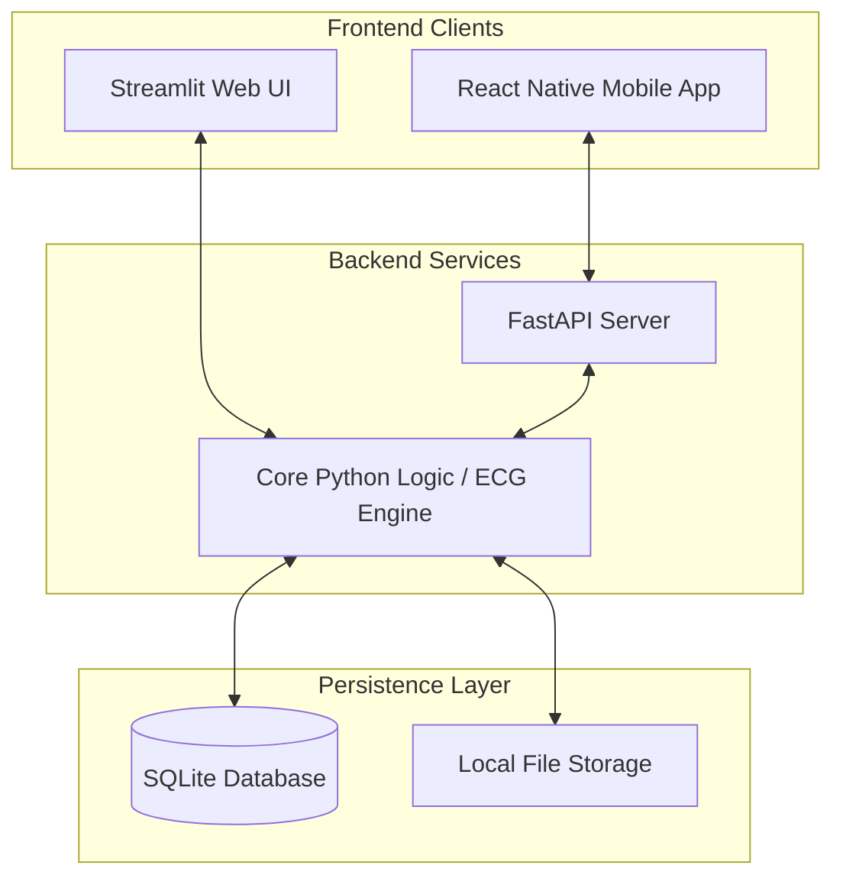
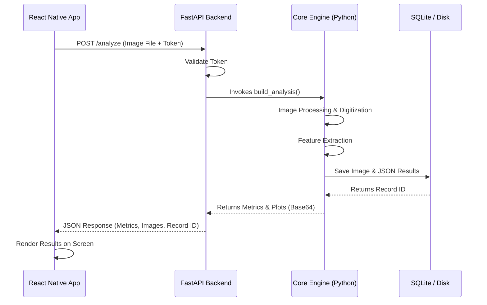

# Architecture Document: ECG Graph Extraction and Analysis System

This document outlines the high-level architecture of the ECG Graph Extraction and Analysis System. The system is designed to process ECG graph images, digitize waveforms, extract clinical features, and facilitate comparison, all while being accessible through both a web interface and a mobile application.

## 1. High-Level System Architecture

The project employs a modular, client-server architecture with three primary components:



### 1.1 Core Engine & Web UI (`ECGComparisonPython.py`)
This is the foundational layer of the system. It contains the core domain logic written in Python and uses Streamlit to render a Web UI.
* **Responsibilities:**
  * **Preprocessing:** Denoising and contrast enhancement of uploaded ECG images (PNG/JPG/PDF).
  * **Analysis:** Grid spacing detection, waveform digitization, and R-peak detection.
  * **Feature Extraction:** Identifying P, Q, R, S, T indices and calculating clinical metrics (Heart Rate, PR interval, QRS duration, QT interval).
  * **Comparison Engine:** Aligning two ECG waveforms using R-peak alignment or cross-correlation, and generating delta visualizations.
  * **Streamlit UI:** Directly invokes core functions to provide a rich web-based GUI for researchers and clinicians.

### 1.2 Mobile Backend API (`mobile_backend/main.py`)
To extend the application to mobile users without duplicating complex signal processing logic, a lightweight FastAPI backend serves as an intermediary.
* **Responsibilities:**
  * **RESTful Endpoints:** Exposes the core Python logic over HTTP (e.g., uploading images, fetching records, comparing ECGs).
  * **Authentication:** Implements a token-based authentication mechanism (HMAC-signed payload) to secure access.
  * **Stateless Processing:** Processes requests, leverages the core engine for heavy lifting, and returns structured JSON responses and Base64-encoded Matplotlib figures for image rendering on the mobile client.

### 1.3 Mobile Application (`mobile_app/`)
A cross-platform mobile frontend built using React Native and Expo.
* **Responsibilities:**
  * **User Experience:** Provides a seamless interface tailored for mobile devices (smartphones/tablets).
  * **Integration:** Communicates exclusively with the FastAPI backend.
  * **Features:** Includes screens for Login, Uploading/Analyzing new ECGs, browsing past Records, and side-by-side Comparisons.

## 2. Data Flow & Persistence

The system uses a local-first persistence strategy to ensure data privacy and simple deployment.

* **File Storage (`data/images/`):** When an ECG image is uploaded, it is deduplicated using SHA-256 hashing and stored securely on the local disk.
* **Relational Database (`data/ecg.db`):** A SQLite database stores:
  * Patient metadata and audit logs.
  * Extracted features and metrics stored flexibly as JSON blobs (`ecg_records` table).
  * Comparison results between two records (`ecg_comparisons` table).

### Sequence of an Analysis Request (Mobile)



## 3. Extensibility & Security

* **Modular Design:** The separation of the core mathematical processing engine from the Fast API server and Streamlit UI allows for easy swapping of frontends or upgrading the core logic (e.g., integrating deep learning for digitization in the future).
* **Security:** Role-Based Access Control (RBAC) and audit logging are implemented in the core logic. Data is kept locally by default, addressing privacy concerns associated with medical records.
* **Mobile Efficiency:** Instead of returning raw data arrays for the mobile app to plot (which could be computationally expensive and difficult to align perfectly), the backend renders Matplotlib figures and sends them as Base64 strings.

## 4. Database Schema

**Table Definitions (DDL):**

```sql
CREATE TABLE IF NOT EXISTS ecg_records (
    id INTEGER PRIMARY KEY AUTOINCREMENT,
    patient_id TEXT,
    ecg_datetime TEXT,
    root_cause TEXT,
    root_cause_time TEXT,
    image_filename TEXT NOT NULL,
    image_hash TEXT NOT NULL,
    analysis_json TEXT NOT NULL,
    created_at TEXT NOT NULL
);

CREATE TABLE IF NOT EXISTS ecg_comparisons (
    id INTEGER PRIMARY KEY AUTOINCREMENT,
    record_a_id INTEGER NOT NULL,
    record_b_id INTEGER NOT NULL,
    alignment_method TEXT,
    delta_json TEXT NOT NULL,
    created_at TEXT NOT NULL,
    FOREIGN KEY(record_a_id) REFERENCES ecg_records(id) ON DELETE CASCADE,
    FOREIGN KEY(record_b_id) REFERENCES ecg_records(id) ON DELETE CASCADE
);

CREATE TABLE IF NOT EXISTS users (
    id INTEGER PRIMARY KEY AUTOINCREMENT,
    username TEXT UNIQUE NOT NULL,
    display_name TEXT,
    role TEXT NOT NULL,
    password_hash TEXT NOT NULL,
    password_salt TEXT NOT NULL,
    enabled INTEGER NOT NULL DEFAULT 1,
    created_at TEXT NOT NULL,
    updated_at TEXT NOT NULL
);

CREATE TABLE IF NOT EXISTS audit_logs (
    id INTEGER PRIMARY KEY AUTOINCREMENT,
    timestamp TEXT NOT NULL,
    event_type TEXT NOT NULL,
    user_id INTEGER,
    username TEXT,
    outcome TEXT NOT NULL,
    details TEXT
);

CREATE TABLE IF NOT EXISTS app_settings (
    key TEXT PRIMARY KEY,
    value TEXT NOT NULL
);
```
