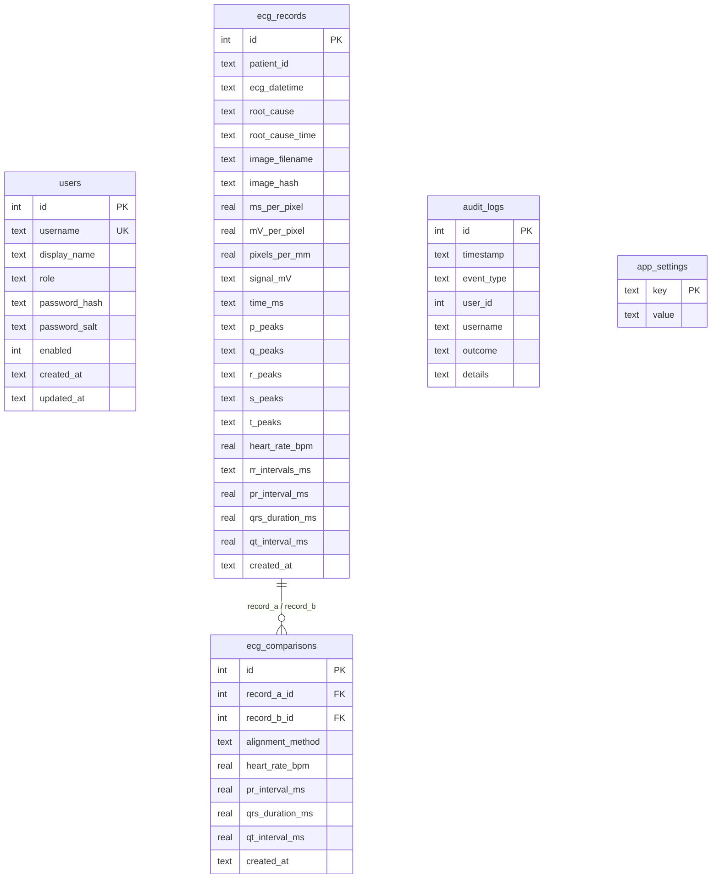

# Database Documentation

This document describes the schema, database design, and key attributes of the SQLite database used in the ECG Comparison Application.

## Database Design Overview

The application utilizes **SQLite** for data persistence. SQLite was chosen for its lightweight, zero-configuration setup, file-based nature, and transactional consistency.

Key database design properties:
* **Foreign Key Constraints**: Enforced at connection initialization using `PRAGMA foreign_keys = ON` to maintain referential integrity.
* **Cascading Deletes**: Comparison records are automatically cleaned up when referenced ECG records are deleted.
* **Content-Addressable Image Storage**: Images are stored in the filesystem (`data/images`) named by their SHA-256 content hashes, avoiding duplication. The database stores the filename and hash for referential integrity.
* **Performance Tuning**: Custom database indexes are created to optimize queries in the Streamlit UI and audit logging modules.
* **Database Migrations**: Simple version-based migrations are handled automatically on connection initialization.

---

## Schema Schema Version: 3

---

## Table Specifications

### 1. `ecg_records`
Stores metadata and parsed algorithmic results of digitized ECG waveform images.

| Column | Type | Constraints | Description |
| :--- | :--- | :--- | :--- |
| `id` | INTEGER | PRIMARY KEY AUTOINCREMENT | Unique record identifier. |
| `patient_id` | TEXT | NULLABLE | Identifier of the patient. |
| `ecg_datetime` | TEXT | NULLABLE | Date and time the ECG was captured. |
| `root_cause` | TEXT | NULLABLE | Diagnostic annotation or cause. |
| `root_cause_time` | TEXT | NULLABLE | Time associated with the diagnostic cause. |
| `image_filename` | TEXT | NOT NULL | Filename of the waveform trace image on disk. |
| `image_hash` | TEXT | NOT NULL | SHA-256 hash of the image file (used for deduplication). |
| `ms_per_pixel` | REAL | NULLABLE | Milliseconds per pixel calibration value. |
| `mV_per_pixel` | REAL | NULLABLE | Millivolts per pixel calibration value. |
| `pixels_per_mm` | REAL | NULLABLE | Grid calibration spacing setting in pixels per mm. |
| `signal_mV` | TEXT | NULLABLE | Serialized JSON array of signal values in mV. |
| `time_ms` | TEXT | NULLABLE | Serialized JSON array of signal timestamps in ms. |
| `p_peaks` | TEXT | NULLABLE | Serialized JSON list of indices for detected P peaks. |
| `q_peaks` | TEXT | NULLABLE | Serialized JSON list of indices for detected Q peaks. |
| `r_peaks` | TEXT | NULLABLE | Serialized JSON list of indices for detected R peaks. |
| `s_peaks` | TEXT | NULLABLE | Serialized JSON list of indices for detected S peaks. |
| `t_peaks` | TEXT | NULLABLE | Serialized JSON list of indices for detected T peaks. |
| `heart_rate_bpm` | REAL | NULLABLE | Heart rate in beats per minute. |
| `rr_intervals_ms` | TEXT | NULLABLE | Serialized JSON list of RR intervals in milliseconds. |
| `pr_interval_ms` | REAL | NULLABLE | PR interval duration in milliseconds. |
| `qrs_duration_ms` | REAL | NULLABLE | QRS duration in milliseconds. |
| `qt_interval_ms` | REAL | NULLABLE | QT interval duration in milliseconds. |
| `created_at` | TEXT | NOT NULL | ISO 8601 timestamp of record insertion. |

### 2. `ecg_comparisons`
Stores the results of comparison/alignment analyses between two distinct ECG records.

| Column | Type | Constraints | Description |
| :--- | :--- | :--- | :--- |
| `id` | INTEGER | PRIMARY KEY AUTOINCREMENT | Unique comparison identifier. |
| `record_a_id` | INTEGER | NOT NULL, FK | Reference to first record (`ecg_records.id`). ON DELETE CASCADE. |
| `record_b_id` | INTEGER | NOT NULL, FK | Reference to second record (`ecg_records.id`). ON DELETE CASCADE. |
| `alignment_method` | TEXT | NULLABLE | Technique used for alignment (e.g. `r-peak` or `cross-correlation`). |
| `heart_rate_bpm` | REAL | NULLABLE | Heart rate delta (B - A) in beats per minute. |
| `pr_interval_ms` | REAL | NULLABLE | PR interval delta (B - A) in milliseconds. |
| `qrs_duration_ms` | REAL | NULLABLE | QRS duration delta (B - A) in milliseconds. |
| `qt_interval_ms` | REAL | NULLABLE | QT interval delta (B - A) in milliseconds. |
| `created_at` | TEXT | NOT NULL | ISO 8601 timestamp of comparison creation. |

### 3. `users`
Stores user profile information, passwords, and user access roles.

| Column | Type | Constraints | Description |
| :--- | :--- | :--- | :--- |
| `id` | INTEGER | PRIMARY KEY AUTOINCREMENT | Unique user identifier. |
| `username` | TEXT | UNIQUE, NOT NULL | Unique login name. |
| `display_name` | TEXT | NULLABLE | Friendly name for display in the UI. |
| `role` | TEXT | NOT NULL | Access level / User role (e.g., `Administrator`, `Viewer`). |
| `password_hash` | TEXT | NOT NULL | Salted SHA-256 hash of password. |
| `password_salt` | TEXT | NOT NULL | Salt used to secure the password hash. |
| `enabled` | INTEGER | DEFAULT 1 | Account status flag (1 = Enabled, 0 = Disabled). |
| `created_at` | TEXT | NOT NULL | ISO 8601 timestamp of account creation. |
| `updated_at` | TEXT | NOT NULL | ISO 8601 timestamp of last profile update. |

### 4. `audit_logs`
Stores security audit logs tracking system actions and administrator access events.

| Column | Type | Constraints | Description |
| :--- | :--- | :--- | :--- |
| `id` | INTEGER | PRIMARY KEY AUTOINCREMENT | Unique audit log entry identifier. |
| `timestamp` | TEXT | NOT NULL | ISO 8601 timestamp of the logged event. |
| `event_type` | TEXT | NOT NULL | Action category (e.g., `login`, `export_all_data`, `delete_record`). |
| `user_id` | INTEGER | NULLABLE | ID of user executing the action. |
| `username` | TEXT | NULLABLE | Username of actor. |
| `outcome` | TEXT | NOT NULL | Outcome of event (e.g., `success`, `failure`). |
| `details` | TEXT | NULLABLE | JSON string or text detailing context or errors. |

### 5. `app_settings`
Configuration table storing persistent application settings.

| Column | Type | Constraints | Description |
| :--- | :--- | :--- | :--- |
| `key` | TEXT | PRIMARY KEY | Configuration parameter identifier. |
| `value` | TEXT | NOT NULL | Parameter value string. |

---

## Indexes

To optimize dashboard queries and search operations, the following indexes are generated:

* **`idx_ecg_records_created_at`**: Created on `ecg_records(created_at)` to accelerate listing and sorting records by date in the Streamlit UI.
* **`idx_ecg_comparisons_record_a`**: Created on `ecg_comparisons(record_a_id)` to speed up comparisons retrieval referencing a given record.
* **`idx_ecg_comparisons_record_b`**: Created on `ecg_comparisons(record_b_id)`.
* **`idx_audit_logs_timestamp`**: Created on `audit_logs(timestamp)` to optimize temporal sorting of audit events in the administrator logs viewer.

---

## Migration Strategy

Database versioning is tracked via the `schema_version` key in the `app_settings` table. 

Upon database initialization:
1. The schema version is read.
2. If the schema version is below the target version (`DB_SCHEMA_VERSION = 3`), incremental migration code blocks execute sequentially.
   * **v1 to v2 Migration**: Checks if `ecg_comparisons` enforces foreign keys. If not, it renames the table, creates a new table with proper `FOREIGN KEY ... ON DELETE CASCADE` definitions, maps the old data, drops the old table, and updates `schema_version` to `2`.
   * **v2 to v3 Migration**: Migrates `ecg_records` and `ecg_comparisons` by renaming tables, creating new ones with expanded individual columns for all metrics, features, and waveform data, parsing their respective JSON properties, inserting the data, and dropping the old tables. Updates `schema_version` to `3`.
3. If successful, changes are committed to disk.
